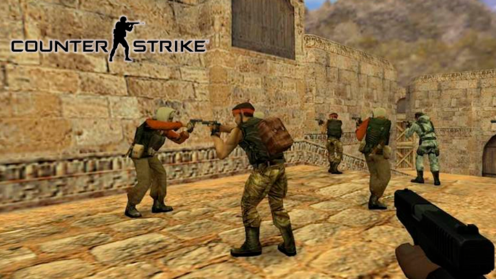

# Counter Strike 1.6



## Instalacion en Debian

```
$ cat AppImage/CounterStrikea* > Counter-Strike-installer-x86_64.AppImage
$ chmod +x Counter-Strike-installer-x86_64.AppImage
$ ./Counter-Strike-installer-x86_64.AppImage
```
## Abrir el juego

* Counter Strike 1.6

	```
	$ ~/.local/cs/cs
	```
* Half Life

	```
	$ ~/.local/cs/hl
	```

## Agregar voces personalizadas

```
$ mv sound/radio/* ~/.local/cs/game/cstrike/sound/radio/
```
