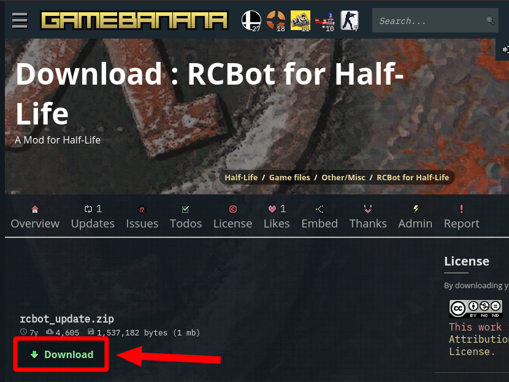
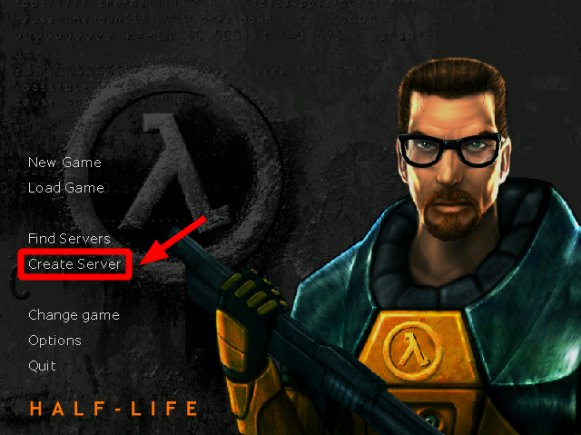
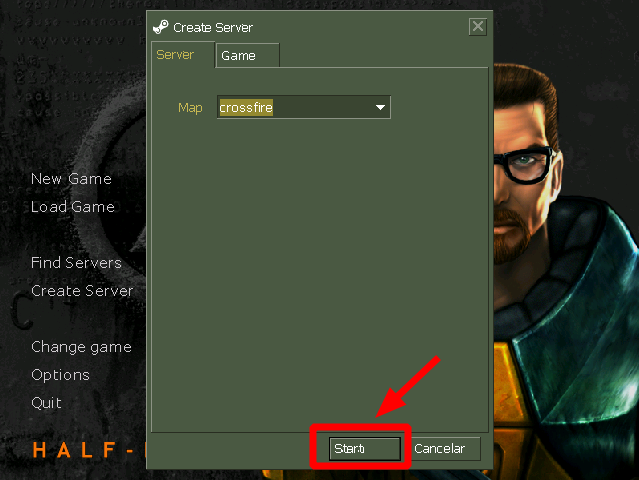
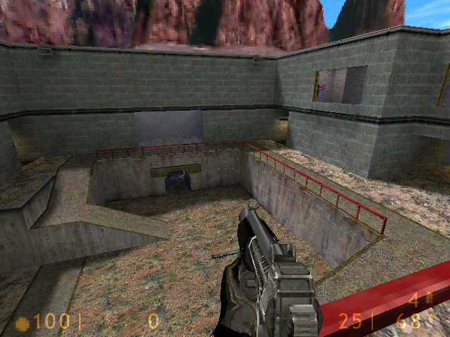
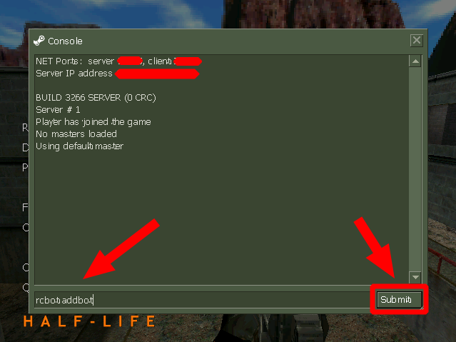
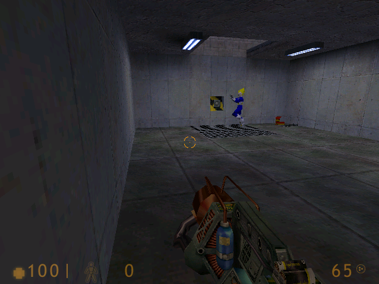
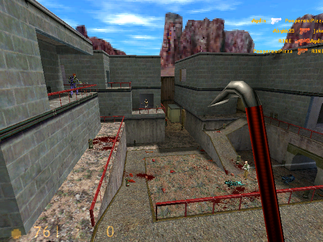
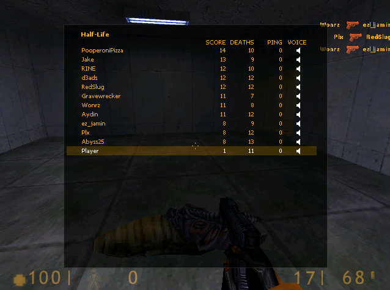

# Agregar bot
1. Descargamos rcbot desde [gamebanana](https://gamebanana.com/gamefiles/download/3211 "Descárgalo de aquí papu")  
	  
2. Descomprimimos  
	```
	$ unzip rcbot_update.zip -d rcbot_update
	```
	Este es el contenido de la carpeta que descomprimimos  
	```
	rcbot_update
	├── rcbot
	│   ├── botprofiles
	│   ├── dlls
	│   ├── map_configs
	│   │   └── valve
	│   └── waypoints
	│       └── valve
	└── valve
	```
	Esta es la rama del directorio del juego instalado en mi computadora  
	```
	.wine
	└── drive_c
	    └── Program Files (x86)
		└── Counter-Strike 1.6
		    └── valve
	```
3. Copiamos el contenido de la carpeta "**rcbot_update**" dentro de la carpeta del juego "**Counter-Strike 1.6**"  
	```
	$ cd ~/Downloads/rcbot_update
	$ cp -r *  ~/.wine/drive_c/Program\ Files\ \(x86\)/Counter-Strike\ 1.6/
	```
4. Entramos al juego y creamos servidor  
	  
	  
	  
5. Instrucciones para agregar un bot  
	1. Abrimos la consola escribiendo: ~  
	2. Para agregar un bot escribimos: **rcbot addbot**  
	  
	  
	  
	  
