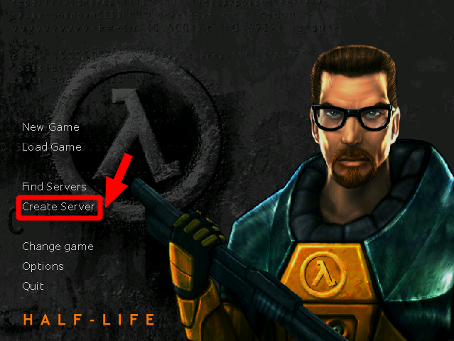

# Agregar Mapa a Half-Life 1
1. Podemos descargar mapas desde estos links:
	1. [gamebanana](https://gamebanana.com/maps/ "Dale click papu")
	2. [galyraffo](https://galyguy.wixsite.com/galyraffo/half-life-mapas-1 "Dale click papu")
2. Como ejemplo voy a descargar el [mapa de Machu Picchu](https://gamebanana.com/maps/210904 "Descárgalo papu") hecho por el gran [Galy Raffo](https://www.youtube.com/channel/UCQkCpwv2_WOwcgmg3-_vsXg "Chequea su canal de youtube")   
	  
	  
	  
	  
3. Descomprimo  
	```
	$ rar x machu_licchu.rar
	```
	Este es el contenido de la carpeta que descomprimimos que contiene el mapa:
	```
	Half-Life
	└── valve
	    ├── gfx
	    │   └── env
	    ├── machupicchu
	    ├── maps
	    └── sound
		└── machupicchu
	```
	La rama de directorios del juego que está instalado en nuestra computadora, en mi caso con Sistema operativo Debian:
	```
	.wine
	└── drive_c
	    └── Program Files (x86)
		└── Counter-Strike 1.6
		    ├── valve
		    │   ├── gfx
		    │   │   ├── env
		    │   │   ├── shell
		    │   │   └── vgui
		    │   │       └── fonts
		    │   ├── logos
		    │   ├── media
		    │   ├── resource
		    │   └── sound
		    └── valve_spanish
		        ├── maps
		        └── sound
			    └── misc
			        └── peruhl2
	```	
4. Copiar el contenido de la carpeta "**valve**" que he descomprimido dentro de la carpeta "**valve**" que corresponde al juego instalado
	1. Me muevo dentro de la carpeta
		```
		$ cd ~/Downloads/Half-Life
		```
	2. Ahí dentro tengo la carpeta "**valve**", la copio dentro del juego
		```
		$ cp -r valve ~/.wine/drive_c/Program\ Files\ \(x86\)/Counter-Strike\ 1.6
		```
5. Ya podemos entrar al mapa
	1. Iniciamos el juego 
		```
		$ cd ~/.wine/drive_c/Program\ Files\ \(x86\)/Counter-Strike\ 1.6
		$ wine hl.exe
		```
	2. Creamos servidor para entrar el mapa    
		  
		  
	3. A jugar!!!   
		   
		   
		   
		   
