# Agregar Skins de players  
1. Descargo los skins de [gamebanana](https://gamebanana.com/skins/cats/465 "Descárgalo de aquí papu")  
	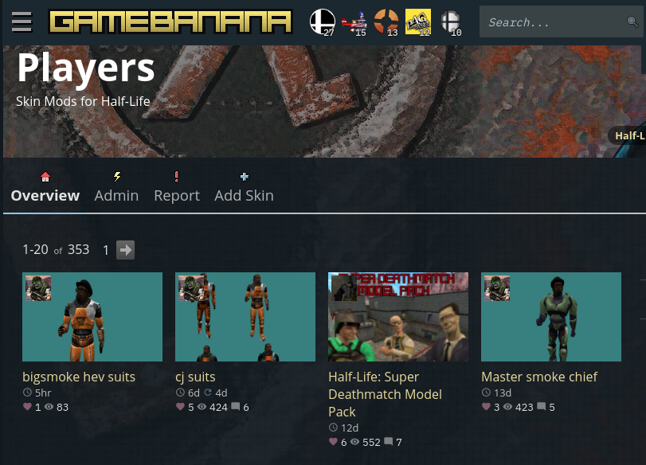   
2. Escogeré el de [Vegeta](https://gamebanana.com/skins/178738 "Descárgalo de aquí")    
	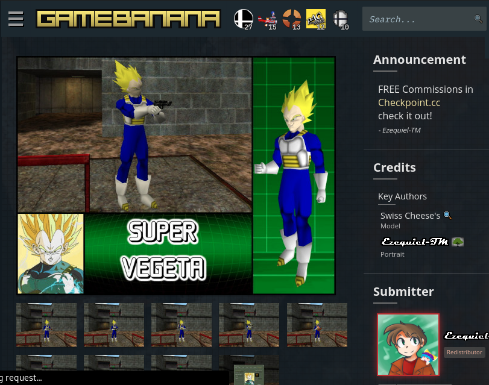   
	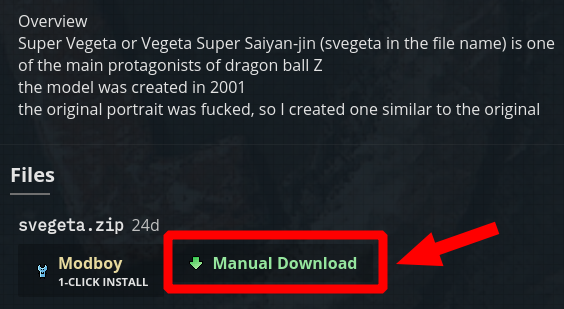   
	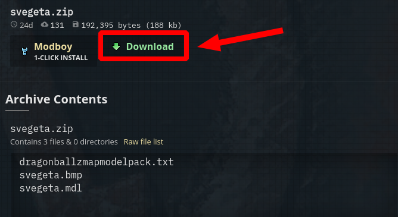   
3. Obtengo esto:     
	   
4. Descomprimo  
	```
	$ unzip svegeta.zip -d svegeta 
	```
	Este es el contenido de la carpeta "**svegeta**"  
	```
	svegeta
	├── dragonballzmapmodelpack.txt
	├── svegeta.bmp
	└── svegeta.mdl
	```
	La rama de directorios del juego que está instalado en nuestra computadora, en mi caso con Sistema operativo Debian:
	```
	.wine
	└── drive_c
	    └── Program Files (x86)
		└── Counter-Strike 1.6
		    └── valve
		        └── models
			    └── player
	```
5. Copiamos la carpeta "**svegeta**" dentro de la carpeta "**player**" que está dentro del juego  
	```
	$ cd ~/Downloads
	$ cp -r svegeta ~/.wine/drive_c/Program\ Files\ \(x86\)/Counter-Strike\ 1.6/valve/models/player
	```
	Y lo tendremos junto a los otros skins de personajes  
	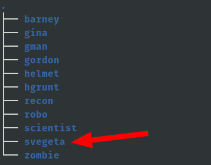  
6. Vamos a verificar que podemos usar ese skin  
	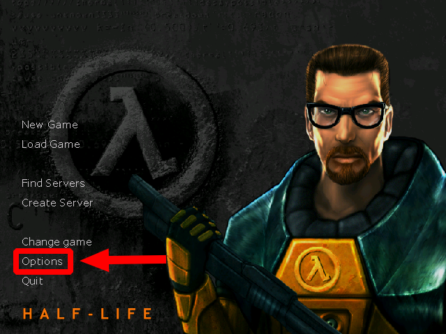  
	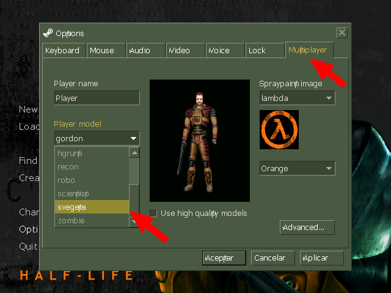  
	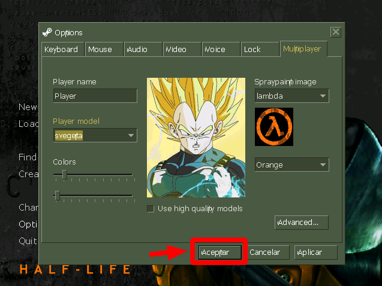  
	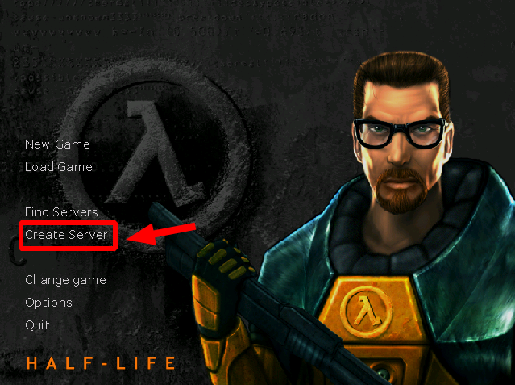  
	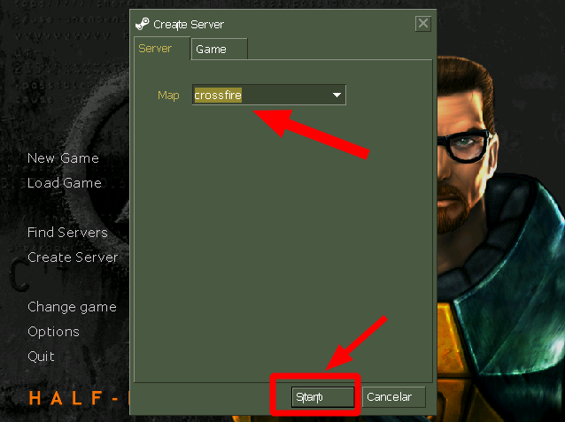  
	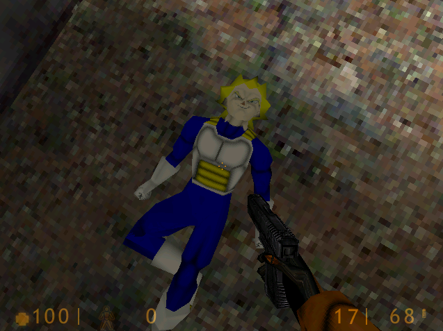  
	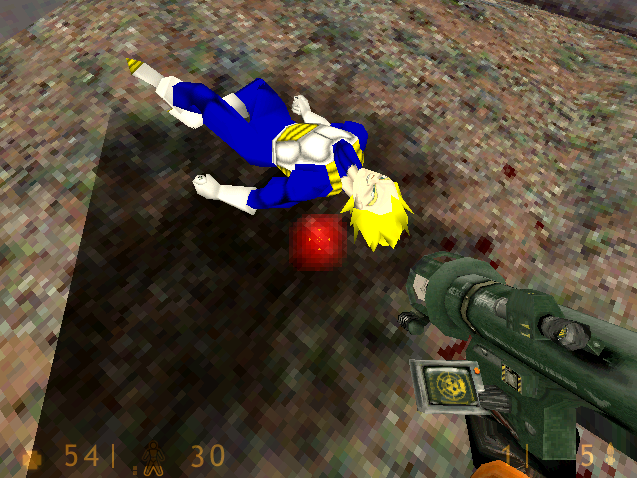  
