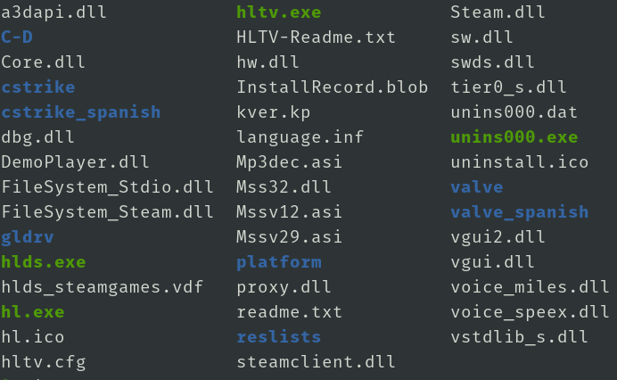
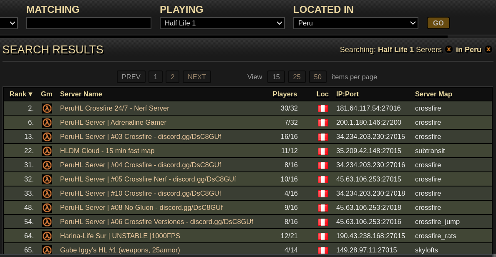
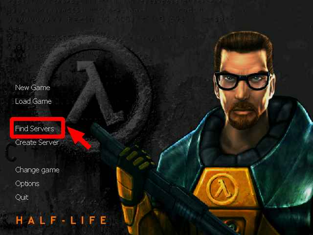
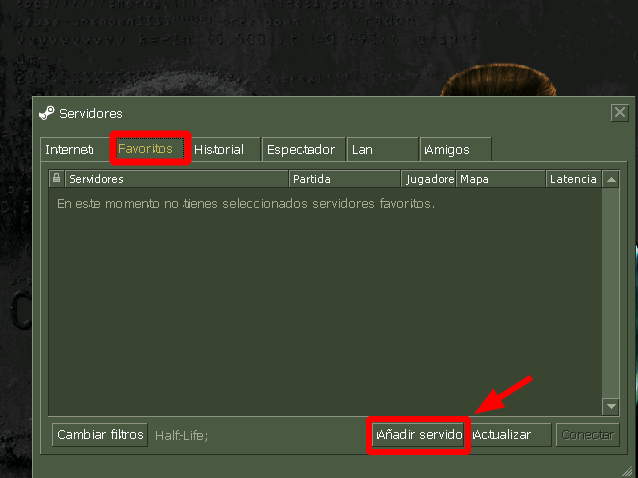
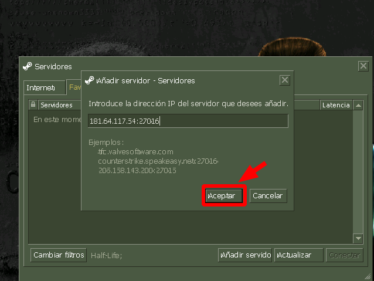
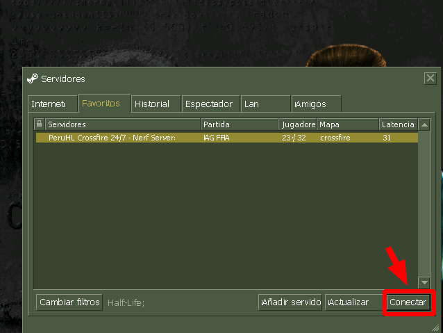
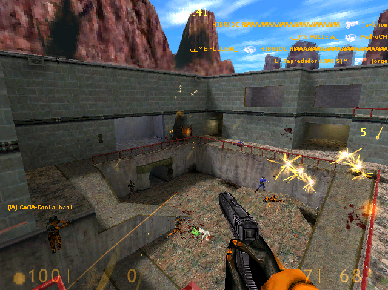

# Half-Life en Debian


## Abrir juego
1. Esta es la ubicación en la que se ha instalado el juego
	```
	.wine
	└── drive_c
	    └── Program Files (x86)
		└── Counter-Strike 1.6
	```
2. Nos ubicamos dentro de la carpeta del juego
	```
	$ cd ~/.wine/drive_c/Program\ Files\ \(x86\)/Counter-Strike\ 1.6
	```
	
3. Ejecutar el juego
	```
	$ wine hl.exe
	```
## Agregar servidor
1. Ingresamos a: www.gametracker.com/servers
	1. En **PLAYING** colocamos	: Half Life 1
	2. En **LOCATED IN** colocamos	: Peru
	3. Click en: **GO**  
	4. Escogemos una IP y la copiamos: 181.64.117.54:27016  
	
2. Agregamos servidor a Half-Life  
	
	
	
	
	
