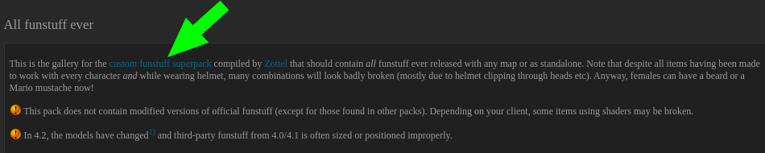
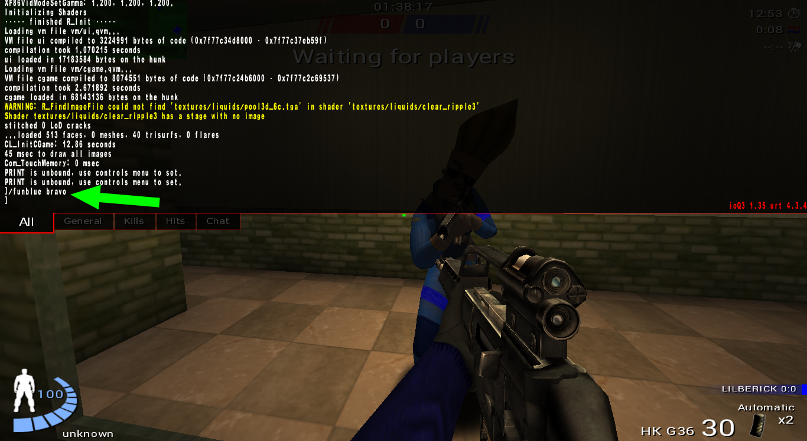

# [Funstuff](https://urbanterror.fandom.com/wiki/Funstuff)

Funstuff is a feature that adds more personality to the players.

## Agregar más funstuff

1. Nos dirigimos a este [link](http://www.dswp.de/old/wiki/doku.php/tutorials:urban_terror:all-funstuff-ever)
2. Descargamos: custom funstuff superpack 

	

3. mover

	```sh
	$ mv zzzallfunstuffever.pk3  ~/.q3a/q3ut4/
	```

4. Abrir consola para introducir comandos (presionar: ~)

	

## Ejemplos

```
/funblue goku
```


```
/funblue bravo
```


```
/funblue brian
```


```
/funblue cat
```


