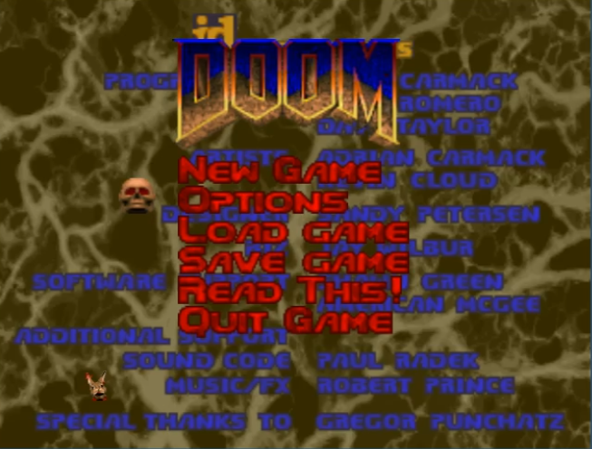

# [gzdoom](https://zdoom.org)


## Instalación ([Raspberry Pi OS](https://www.raspberrypi.com/software/operating-systems/))

1. Habilitar gl driver (Fake KMS o Full KMS)

	```
	$ sudo raspi-config
	```

 	Click en: Advanced Options/GL Driver/GL (Fake KMS)  

	```
	$ sudo reboot
	```

	

2. Descargar [gzdoom](https://zdoom.org/files/gzdoom/bin/) para la arquitectura ARM

	

2. instalar

	```
	$ sudo apt install libjpeg8
	$ sudo dpkg -i gzdoom_3.4.1_armhf.deb
	```

## Configuración



| CUSTOMIZE CONTROLS	| 		| 
|-----------------------|---------------|
| Fire			| Mouse 1	|
| Secondary Fire	| Mouse 2	|
| Use/Open		| E		|
| Mouse Forward		| W		|
| Mouse Backward	| S		|
| Strafe Left		| A		|
| Strafe Right		| D		|
| Jump			| Space		|
| Crouch		| C		|


| MOUSE OPTIONS		| 		|
|-----------------------|---------------|
| Always Mouselook	| On		|
